# Servidor REST — Sistema de Evaluación de Desempeño UNDA

Documentación técnica del backend ubicado en `server/`. El servidor es una **API REST** construida con **Express 5**, **Prisma ORM**, **MySQL** y autenticación mediante **JWT**.

---

## Tabla de Contenidos

1. [Stack tecnológico](#1-stack-tecnológico)
2. [Estructura de directorios](#2-estructura-de-directorios)
3. [Arquitectura general](#3-arquitectura-general)
4. [Arranque y ciclo de vida](#4-arranque-y-ciclo-de-vida)
5. [Endpoints de la API](#5-endpoints-de-la-api)
6. [Middlewares](#6-middlewares)
7. [Capa de servicios](#7-capa-de-servicios)
8. [Modelo de datos — Prisma / MySQL](#8-modelo-de-datos--prisma--mysql)
9. [Generación de PDF con Playwright](#9-generación-de-pdf-con-playwright)
10. [Servicio de email (Nodemailer / Gmail SMTP)](#10-servicio-de-email-nodemailer--gmail-smtp)
11. [Validador de evaluaciones](#11-validador-de-evaluaciones)
12. [Mapper de evaluaciones](#12-mapper-de-evaluaciones)
13. [Diagrama de flujo de una petición HTTP](#13-diagrama-de-flujo-de-una-petición-http)
14. [Diagrama de secuencia — Autenticación JWT](#14-diagrama-de-secuencia--autenticación-jwt)
15. [Diagrama de secuencia — Creación de evaluación](#15-diagrama-de-secuencia--creación-de-evaluación)
16. [Diagrama de secuencia — Generación y envío de PDF](#16-diagrama-de-secuencia--generación-y-envío-de-pdf)
17. [Diagrama de clases — Servicios y controladores](#17-diagrama-de-clases--servicios-y-controladores)
18. [Diagrama entidad-relación](#18-diagrama-entidad-relación)

---

## 1. Stack tecnológico

| Capa | Tecnología |
|---|---|
| Framework HTTP | Express 5 |
| ORM | Prisma 6 |
| Base de datos | MySQL |
| Autenticación | JWT (`jsonwebtoken`) + bcrypt |
| Validación | Zod v4 |
| Generación de PDF | Playwright (Chromium headless) |
| Email | Nodemailer (Gmail SMTP) |
| Logging | Pino + pino-http |
| Fechas | date-fns v4 |
| Runtime | Node.js + tsx (TypeScript) |
| Lenguaje | TypeScript 5.9 |

---

## 2. Estructura de directorios

```
server/
├── src/
│   ├── server.ts               # Entry point: conecta BD e inicia HTTP server
│   ├── app.ts                  # Instancia Express + CORS + rutas montadas
│   ├── logger.ts               # Instancia Pino
│   │
│   ├── routes/                 # Definición de rutas Express por recurso
│   │   ├── auth.route.ts
│   │   ├── empleado.route.ts
│   │   ├── evaluacion.route.ts
│   │   ├── itemEvaluacion.route.ts
│   │   ├── supervisor.route.ts
│   │   └── usuario.route.ts
│   │
│   ├── controllers/            # Capa HTTP: parseo de req/res, delegación al service
│   │   ├── auth.controllers.ts
│   │   ├── empleado.controller.ts
│   │   ├── evaluacion.controller.ts
│   │   ├── itemEvaluacion.controller.ts
│   │   ├── supervisor.controller.ts
│   │   └── usuario.controller.ts
│   │
│   ├── services/               # Lógica de negocio pura
│   │   ├── auth.service.ts
│   │   ├── email.service.ts
│   │   ├── empleado.service.ts
│   │   ├── evaluacion.service.ts
│   │   ├── itemEvaluacion.service.ts
│   │   ├── supervisor.service.ts
│   │   └── usuario.service.ts
│   │
│   ├── middlewares/
│   │   ├── auth.middleware.ts  # authenticate (JWT) + authorize (roles)
│   │   └── validateRequest.ts  # Zod schema validator para body/query/params
│   │
│   ├── schemas/                # Zod schemas compartidos (mismo contenido que web/schemas/)
│   │   ├── auth.schema.ts
│   │   ├── email.schema.ts
│   │   ├── empleado.schema.ts
│   │   ├── evaluacion.schema.ts
│   │   ├── evaluacionItemResultado.schema.ts
│   │   ├── itemEvaluacion.schema.ts
│   │   ├── pagination.schema.ts
│   │   ├── password.schema.ts
│   │   ├── supervisor.schema.ts
│   │   └── usuario.schema.ts
│   │
│   ├── prisma/
│   │   ├── schema.prisma       # Modelo de datos completo
│   │   ├── prismaClient.ts     # Singleton de PrismaClient
│   │   ├── seed.ts             # Datos iniciales
│   │   └── migrations/        # Historial de migraciones SQL
│   │
│   ├── mappers/
│   │   └── evaluacion.mapper.ts  # Prisma raw → EvaluacionResponseDTO
│   │
│   ├── validators/
│   │   └── evaluacion.validator.ts  # Validaciones de negocio de evaluaciones
│   │
│   ├── templates/              # Plantillas HTML para generación de PDF
│   │   ├── formato-evaluacion.html
│   │   ├── formato-solicitud-permiso.html
│   │   ├── formato-notificacion.html
│   │   └── reporte-empleados.html
│   │
│   ├── config/
│   │   └── pagination.ts       # DEFAULT_LIMIT, MAX_LIMIT
│   │
│   └── utils/
│       └── getErrorMessage.ts  # Extrae mensaje legible de cualquier error
│
├── prisma.config.ts
└── package.json
```

---

## 3. Arquitectura general

```mermaid
graph TD
    subgraph Cliente
        FE["Frontend Next.js\n:3000"]
    end

    subgraph "Express App (:5000)"
        MW_CORS[CORS Middleware]
        MW_JSON[express.json]
        MW_LOG[pino-http Logger]
        MW_AUTH[authenticate\nauthorize]
        MW_VAL[validateRequest\nZod]

        subgraph Routers
            R_AUTH[/api/auth]
            R_USR[/api/usuarios]
            R_EMP[/api/empleados]
            R_ITEM[/api/items-evaluaciones]
            R_EVAL[/api/evaluaciones]
            R_SUP[/api/supervisores]
        end

        subgraph Controllers
            C_AUTH[AuthController]
            C_USR[UsuarioController]
            C_EMP[EmpleadoController]
            C_ITEM[ItemEvaluacionController]
            C_EVAL[EvaluacionController]
            C_SUP[SupervisorController]
        end

        subgraph Services
            S_AUTH[AuthService]
            S_USR[UsuarioService]
            S_EMP[EmpleadoService]
            S_ITEM[ItemEvaluacionService]
            S_EVAL[EvaluacionService]
            S_SUP[SupervisorService]
            S_EMAIL[EmailService]
        end
    end

    subgraph Infraestructura
        DB[(MySQL)]
        PRISMA[PrismaClient]
        PDF[Playwright\nChromium]
        SMTP[Gmail SMTP]
    end

    FE -->|HTTP + JWT| MW_CORS --> MW_JSON --> MW_LOG
    MW_LOG --> Routers
    Routers --> MW_AUTH --> MW_VAL --> Controllers
    Controllers --> Services
    Services --> PRISMA --> DB
    Services --> PDF
    Services --> S_EMAIL --> SMTP
```

---

## 4. Arranque y ciclo de vida

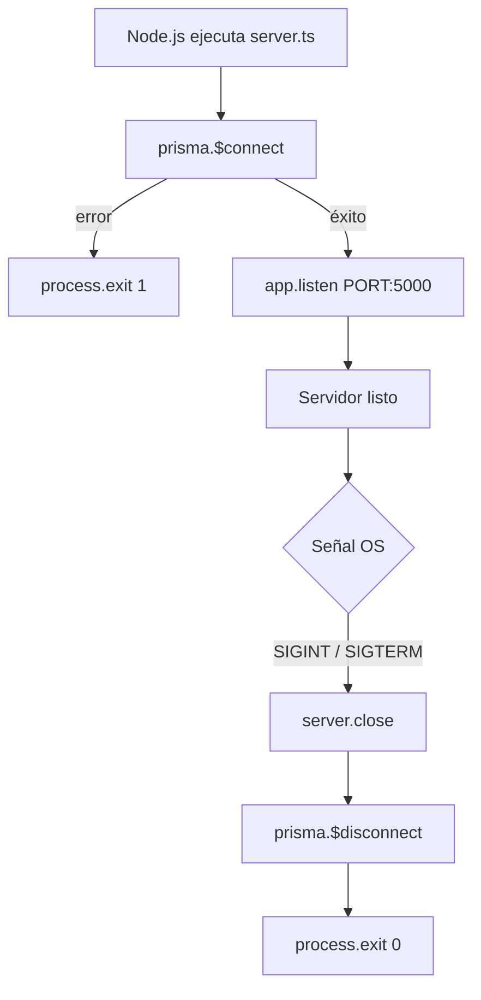

### Variables de entorno requeridas (`.env`)

| Variable | Descripción |
|---|---|
| `DATABASE_URL` | Cadena de conexión MySQL |
| `JWT_SECRET` | Secreto para firmar access tokens (15 min) |
| `JWT_REFRESH_SECRET` | Secreto para refresh tokens (7 días) |
| `BCRYPT_SALT_ROUNDS` | Rondas bcrypt (default: 10) |
| `SERVER_PORT` | Puerto del servidor (default: 5000) |
| `EMAIL_USER` | Cuenta Gmail remitente |
| `EMAIL_PASS` | App password de Gmail |
| `EMAIL_FROM_NAME` | Nombre visible del remitente |

---

## 5. Endpoints de la API

### Auth — `/api/auth`

| Método | Ruta | Descripción | Middlewares |
|---|---|---|---|
| POST | `/login` | Autenticar usuario → `{accessToken, refreshToken, user}` | validateRequest |
| POST | `/refresh` | Renovar access token usando refresh token | — |
| POST | `/forgot-password` | Enviar código de recuperación al email | validateRequest |
| POST | `/verify-reset-token` | Validar código de 6 dígitos | validateRequest |
| POST | `/reset-password` | Cambiar contraseña con código verificado | validateRequest |

### Usuarios — `/api/usuarios`

| Método | Ruta | Descripción |
|---|---|---|
| POST | `/` | Crear usuario (empleado interno o supervisor externo) |
| GET | `/` | Listar usuarios con filtros y paginación |
| GET | `/:id` | Obtener usuario por ID |
| PATCH | `/:id` | Actualizar parcialmente (email, password, rol) |
| DELETE | `/:id` | Eliminar usuario |

### Empleados — `/api/empleados`

| Método | Ruta | Descripción |
|---|---|---|
| POST | `/` | Crear empleado |
| GET | `/` | Listar con filtros (search, tipoPersonal, sexo, dependencia, cargo) |
| GET | `/report` | Generar PDF de reporte filtrado |
| GET | `/:id` | Obtener empleado por ID |
| PATCH | `/:id` | Actualizar parcialmente |
| DELETE | `/:id` | Eliminar empleado |
| POST | `/:id/solicitud-permiso` | Generar PDF de solicitud de permiso |
| POST | `/:id/notificacion` | Generar PDF de notificación |
| POST | `/:id/solicitud-permiso/send-email` | Generar PDF y enviar por email |
| POST | `/:id/notificacion/send-email` | Generar PDF de notificación y enviar por email |

### Evaluaciones — `/api/evaluaciones`

| Método | Ruta | Descripción |
|---|---|---|
| POST | `/` | Crear evaluación con ítems resultado |
| GET | `/` | Listar con filtros (periodos, IDs, rango, totalFinal) |
| GET | `/:id` | Obtener evaluación completa con ítems |
| PATCH | `/:id` | Actualizar evaluación y recalcular totales |
| DELETE | `/:id` | Eliminar evaluación |
| GET | `/:id/generate-pdf` | Generar y descargar PDF de la evaluación |
| POST | `/:id/send-email` | Generar PDF y enviar por email |

### Supervisores — `/api/supervisores`

| Método | Ruta | Descripción |
|---|---|---|
| GET | `/` | Listar supervisores con paginación y búsqueda |
| GET | `/:id` | Obtener supervisor por ID |
| PATCH | `/:id` | Actualizar datos del supervisor |

### Ítems de Evaluación — `/api/items-evaluaciones`

| Método | Ruta | Descripción |
|---|---|---|
| GET | `/` | Listar ítems con filtros (tipoItem, peso, obligatorio, esSistema) |
| GET | `/:id` | Obtener ítem por ID |

---

## 6. Middlewares

### `authenticate` — Verificación JWT

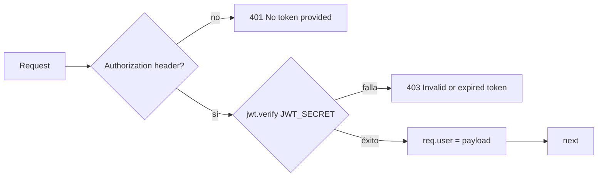

### `authorize(roles[])` — Control de acceso por rol

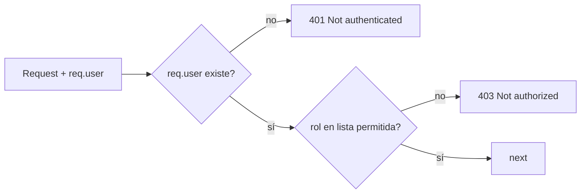

### `validateRequest(schema)` — Validación Zod

Valida de forma independiente `body`, `query` y/o `params` contra schemas Zod. Si falla alguno, responde `400` con `errors` detallados en formato `flatten()`. Si pasa, reemplaza `req.body/query/params` con los datos parseados y transformados.

---

## 7. Capa de servicios

### `AuthService`

| Método | Descripción |
|---|---|
| `login(email, password)` | Busca usuario, compara hash bcrypt, emite accessToken (15 min) y refreshToken (7 días) |
| `refresh(token)` | Verifica refreshToken con `JWT_REFRESH_SECRET`, emite nuevo accessToken |
| `requestPasswordReset(email)` | Genera código de 6 dígitos, lo persiste en BD con expiración de 15 min, envía email |
| `verifyResetToken(email, token)` | Valida código y expiración |
| `resetPassword(email, token, newPassword)` | Verifica token, hashea nueva contraseña, limpia campos reset en BD |

### `UsuarioService`

Crea usuarios con lógica **discriminada por rol**:
- `SUPERVISOR` → crea primero `SupervisorExterno`, luego `Usuario` vinculado.
- Otros roles → crea primero `Empleado`, luego `Usuario` vinculado.

Soporte completo CRUD con hash bcrypt automático en create y patch.

### `EmpleadoService`

- CRUD completo con filtros dinámicos (OR sobre nombres/apellidos/cédula).
- **Paginación dual**: soporta `page+limit` y `offset` directamente.
- Transacciones `$transaction` para `count + findMany` simultáneos.
- Generación de PDF con Playwright para: solicitud de permiso, notificación y reporte de empleados.

### `EvaluacionService`

El servicio más complejo, con transacciones Prisma para garantizar consistencia:

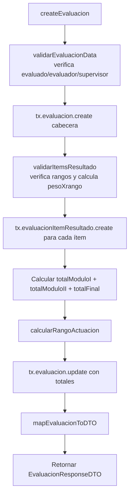

### `SupervisorService`

CRUD básico con búsqueda full-text sobre múltiples campos (email, nombres, apellidos, cédula, cargo, dependencia). No permite eliminar supervisores que tengan cuenta de usuario asociada.

### `ItemEvaluacionService`

Solo lectura (GET all + GET by ID). Los ítems son configurados previamente en la BD (sistema) y no se crean desde la UI.

### `EmailService`

Singleton exportado. Usa Nodemailer con transporte Gmail SMTP. Expone:
- `sendEmail(to, subject, htmlBody)` — email sin adjunto
- `sendPdfEmail(to, subject, htmlBody, pdfBuffer, filename)` — email con PDF adjunto
- Generadores de templates HTML: `generatePasswordResetEmailBody`, `generateSolicitudPermisoEmailBody`, `generateNotificacionEmailBody`, `generateEvaluacionEmailBody`

---

## 8. Modelo de datos — Prisma / MySQL

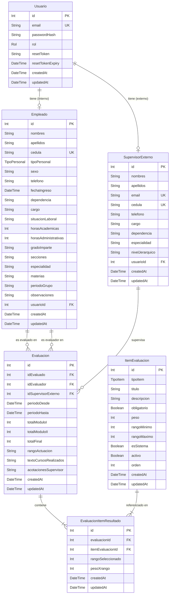

### Enums del modelo

| Enum | Valores |
|---|---|
| `Rol` | `ADMINISTRATIVO`, `SUPERVISOR`, `DIRECTOR`, `COORDINADOR` |
| `TipoPersonal` | `ADMINISTRATIVO_DOCENTE`, `ADMINISTRATIVO`, `OBRERO`, `DOCENTE` |
| `TipoItem` | `ODI`, `COMPETENCIA` |

### Relaciones clave

- `Empleado ↔ Usuario`: relación 1-a-1 opcional. Al eliminar `Usuario` → `usuarioId` en Empleado se pone `NULL` (`onDelete: SetNull`).
- `Evaluacion` tiene dos FK a `Empleado` (evaluado y evaluador), identificadas por nombres de relación distintos (`"Evaluado"`, `"Evaluador"`).
- `EvaluacionItemResultado` tiene restricción única compuesta `(evaluacionId, itemEvaluacionId)` y se elimina en cascada si se elimina la `Evaluacion`.

---

## 9. Generación de PDF con Playwright

Tanto `EmpleadoService` como `EvaluacionService` usan Playwright (Chromium headless) para convertir HTML a PDF:

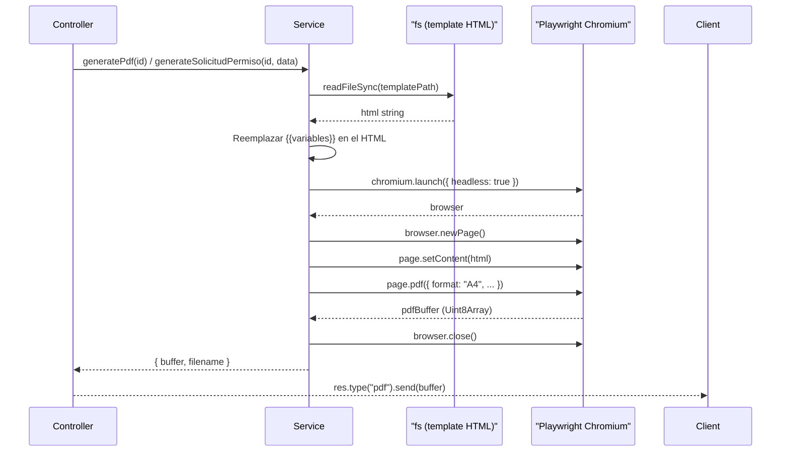

### Plantillas disponibles

| Archivo | Uso |
|---|---|
| `formato-evaluacion.html` | PDF de evaluación de desempeño completa |
| `formato-solicitud-permiso.html` | Documento de solicitud de días de permiso |
| `formato-notificacion.html` | Notificación individual del empleado |
| `reporte-empleados.html` | Tabla de empleados filtrada (landscape A4) |

---

## 10. Servicio de email (Nodemailer / Gmail SMTP)

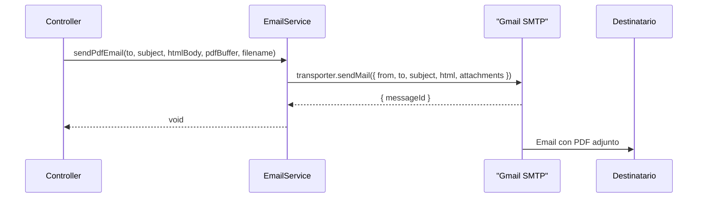

El `EmailService` se instancia como **singleton** y verifica la conexión SMTP en el constructor. En caso de error de conexión, lo registra pero no lanza excepción (para no impedir el arranque del servidor).

---

## 11. Validador de evaluaciones

`validators/evaluacion.validator.ts` centraliza las reglas de negocio más complejas de la evaluación:

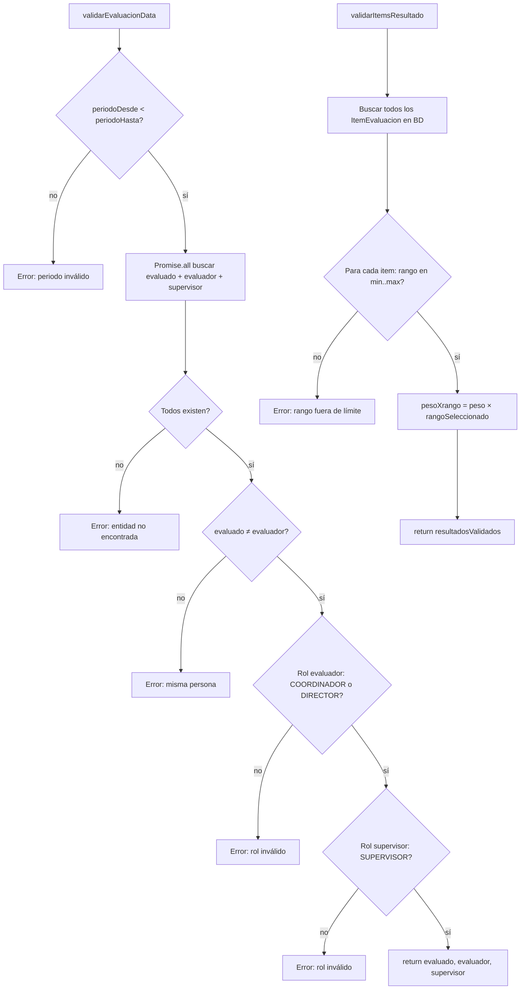

---

## 12. Mapper de evaluaciones

`mappers/evaluacion.mapper.ts` convierte el objeto crudo de Prisma al DTO de respuesta:

- Transforma fechas `Date` → `DD-MM-YYYY` (UTC-safe, sin desfase de zona horaria).
- Transforma timestamps `Date` → ISO string.
- Aplana la relación `itemsResultado → itemEvaluacion` al formato esperado por el cliente.

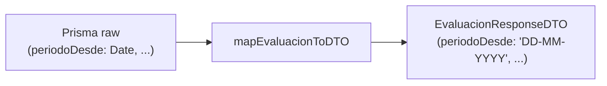

---

## 13. Diagrama de flujo de una petición HTTP

El siguiente diagrama muestra el pipeline completo para cualquier ruta protegida y con validación:

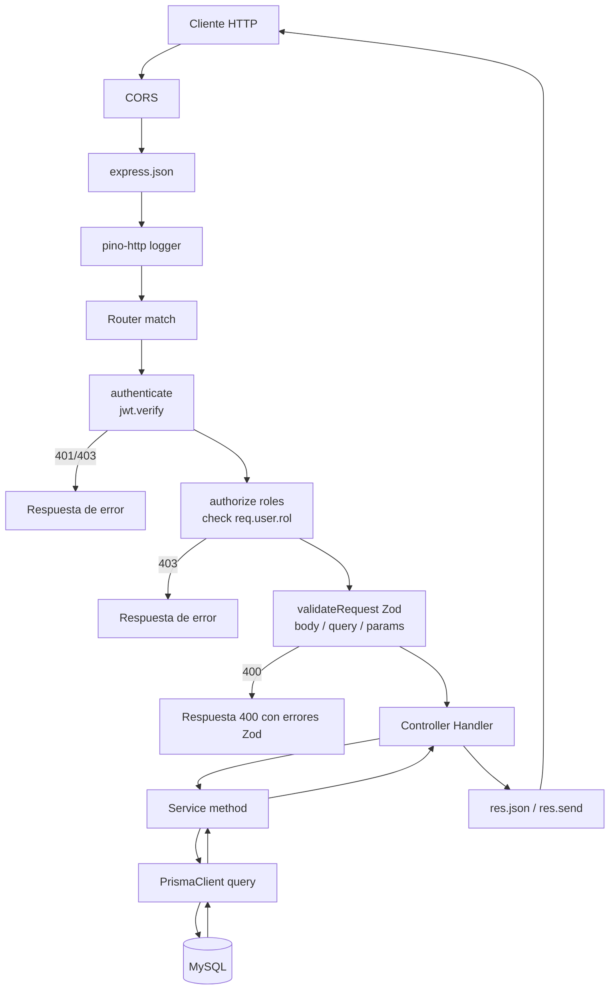

---

## 14. Diagrama de secuencia — Autenticación JWT

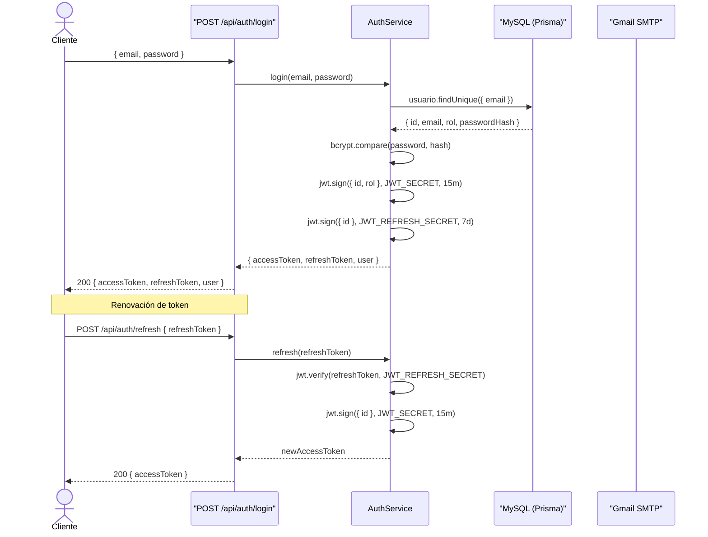

---

## 15. Diagrama de secuencia — Creación de evaluación

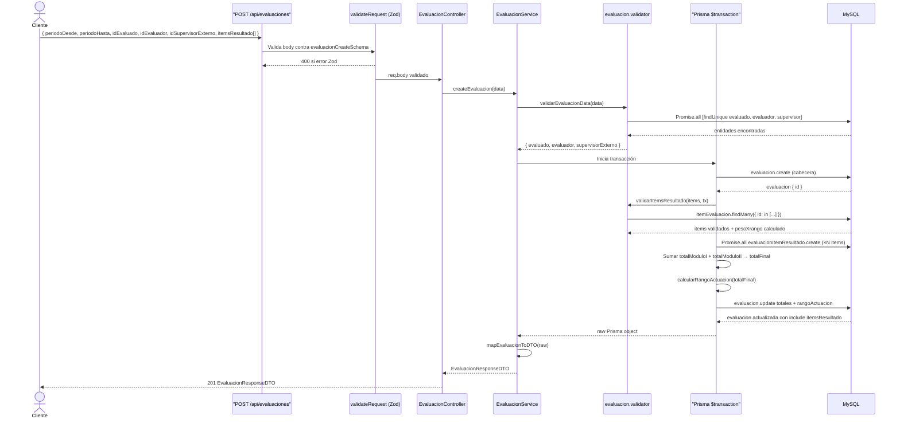

---

## 16. Diagrama de secuencia — Generación y envío de PDF

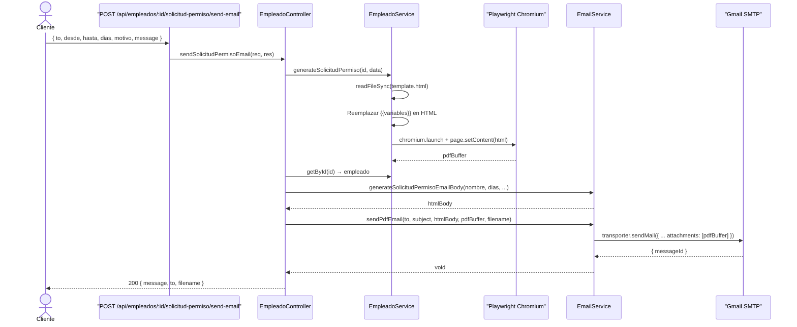

---

## 17. Diagrama de clases — Servicios y controladores

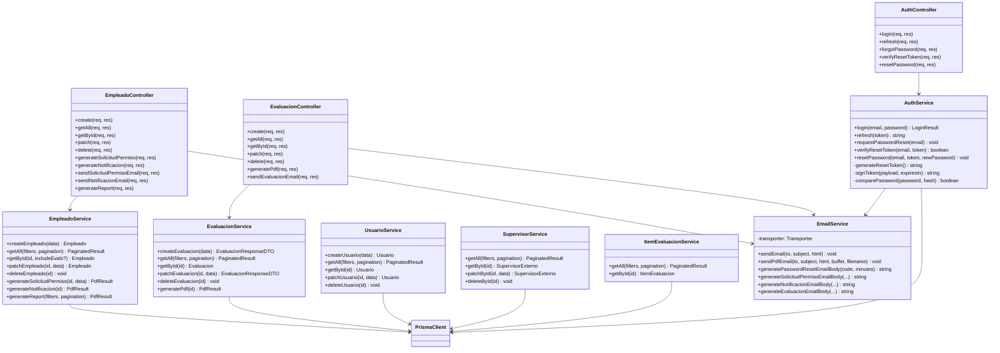

---

## 18. Diagrama entidad-relación

Vista simplificada de cardinalidades:

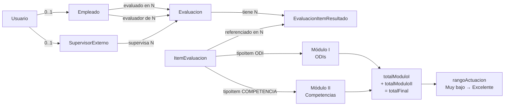

### Lógica de cálculo de rango de actuación (espejada del frontend)

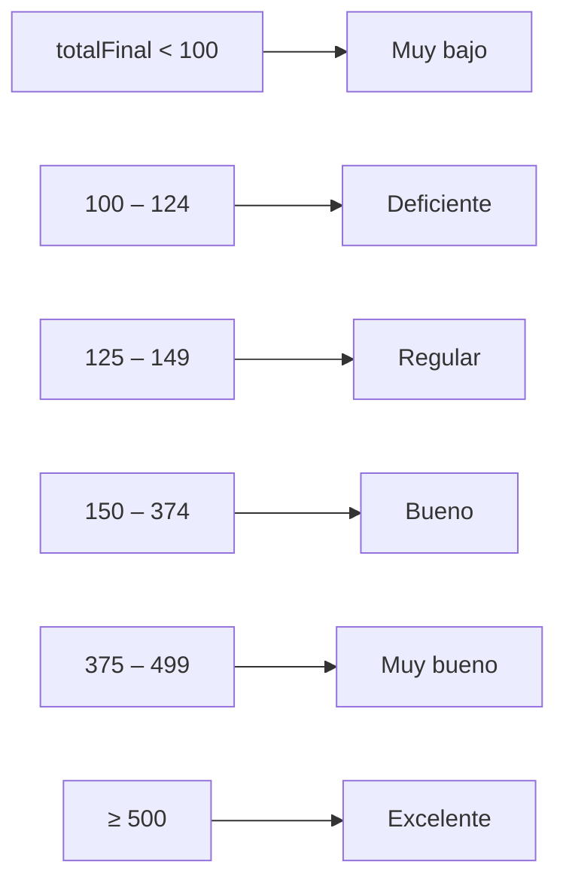

---

> **Generado automáticamente** a partir del análisis del código fuente en `server/`.  
> Última actualización: junio 2026.
