# Cliente Web — Sistema de Evaluación de Desempeño UNDA

Documentación técnica del frontend ubicado en `web/`. El cliente es una aplicación **Next.js 15** (App Router) con **React 19**, **Mantine UI v8**, **TanStack Query v5** y autenticación vía **NextAuth v5**.

---

## Tabla de Contenidos

1. [Stack tecnológico](#1-stack-tecnológico)
2. [Estructura de directorios](#2-estructura-de-directorios)
3. [Arquitectura general](#3-arquitectura-general)
4. [Flujo de autenticación](#4-flujo-de-autenticación)
5. [Enrutamiento y páginas](#5-enrutamiento-y-páginas)
6. [Control de acceso por rol](#6-control-de-acceso-por-rol)
7. [Capa de datos — Hooks y API](#7-capa-de-datos--hooks-y-api)
8. [Componentes](#8-componentes)
9. [Schemas de validación (Zod)](#9-schemas-de-validación-zod)
10. [Helpers](#10-helpers)
11. [Diagrama de componentes por módulo](#11-diagrama-de-componentes-por-módulo)
12. [Diagrama de secuencia — Login](#12-diagrama-de-secuencia--login)
13. [Diagrama de secuencia — CRUD genérico](#13-diagrama-de-secuencia--crud-genérico)
14. [Diagrama de clases — DTOs / Schemas](#14-diagrama-de-clases--dtos--schemas)
15. [Diagrama de estados — modal CRUD](#15-diagrama-de-estados--modal-crud)

---

## 1. Stack tecnológico

| Capa | Tecnología |
|---|---|
| Framework | Next.js 15 (App Router) |
| UI | Mantine v8, Tabler Icons, mantine-datatable |
| Estado servidor | TanStack Query v5 |
| Formularios | React Hook Form v7 |
| Validación | Zod v4 |
| Autenticación | NextAuth v5 (Credentials provider, JWT) |
| HTTP client | Axios v1 |
| Fechas | dayjs, date-fns |
| Lenguaje | TypeScript 5.9 |
| Package manager | Yarn 4 (berry) |

---

## 2. Estructura de directorios

```
web/
├── app/                        # App Router de Next.js
│   ├── api/auth/[...nextauth]/ # Manejador de NextAuth
│   ├── auth/
│   │   ├── login/              # Página de inicio de sesión
│   │   └── forgot-password/    # Recuperación de contraseña
│   ├── dashboard/              # Área protegida principal
│   │   ├── layout.tsx          # Shell con sidebar y RoleGuard
│   │   ├── page.tsx            # Panel de control (tarjetas de módulos)
│   │   ├── empleados/page.tsx
│   │   ├── supervisores/page.tsx
│   │   ├── usuarios/page.tsx
│   │   └── evaluaciones/page.tsx
│   ├── providers/
│   │   └── QueryProvider.tsx   # TanStack QueryClientProvider
│   ├── unauthorized/           # Página de acceso denegado
│   ├── layout.tsx              # Root layout (MantineProvider, SessionProvider)
│   ├── page.tsx                # Raíz → redirige a /dashboard
│   └── middleware.ts           # Middleware Next.js
│
├── components/
│   ├── auth/
│   │   ├── LoginForm.tsx
│   │   ├── ForgotPasswordForm.tsx
│   │   └── RoleGuard.tsx
│   ├── common/
│   │   ├── CRUDTable.tsx           # Tabla genérica con filtros y paginación
│   │   ├── CRUDModal.tsx
│   │   ├── CRUDTableContainer.tsx
│   │   ├── DeleteDialogCRUD.tsx
│   │   ├── LoadingOverlayScreen.tsx
│   │   ├── NavbarContent.tsx
│   │   └── ColorSchemeToggle/
│   ├── empleados/
│   │   ├── EmpleadoForm.tsx
│   │   ├── EmpleadosCRUDTable.tsx
│   │   └── SolicitudPermisoForm.tsx
│   ├── supervisores/
│   │   ├── SupervisorForm.tsx
│   │   └── SupervisoresCRUDTable.tsx
│   ├── usuarios/
│   │   ├── UsuarioForm.tsx
│   │   └── UsuariosCRUDTable.tsx
│   ├── evaluaciones/
│   │   ├── EvaluacionForm.tsx
│   │   ├── EvaluacionesCRUDTable.tsx
│   │   ├── EmpleadoSelect.tsx
│   │   ├── EvaluadorSelect.tsx
│   │   └── SupervisorSelect.tsx
│   ├── items/
│   │   ├── ItemEvaluacionForm.tsx
│   │   └── ItemsEvaluacionTable.tsx
│   └── mail/
│       └── EnviarEmailForm.tsx
│
├── hooks/                      # Custom hooks — TanStack Query
│   ├── auth/usePasswordRecovery.ts
│   ├── empleado/useEmpleadoQueries.ts
│   ├── evaluacion/useEvaluacionQueries.ts
│   ├── evaluacionItemResultado/useEvaluacionItemResultadoQueries.ts
│   ├── item/useItemEvaluacionQueries.ts
│   ├── supervisor/useSupervisorQueries.ts
│   └── usuario/useUsuarioQueries.ts
│
├── schemas/                    # Zod schemas + tipos inferidos
│   ├── auth.schema.ts
│   ├── email.schema.ts
│   ├── empleado.schema.ts
│   ├── evaluacion.schema.ts
│   ├── evaluacionItemResultado.schema.ts
│   ├── itemEvaluacion.schema.ts
│   ├── pagination.schema.ts
│   ├── password.schema.ts
│   ├── supervisor.schema.ts
│   └── usuario.schema.ts
│
├── services/
│   └── api.ts                  # Instancia axios + interceptor de refresh token
│
├── helpers/
│   ├── badges.ts
│   ├── date-parse.ts
│   ├── dateHelpers.ts
│   ├── evaluacion.ts           # Cálculo de totales y rangos de actuación
│   └── selectsData.ts          # Datos estáticos para selects
│
├── types/
│   └── crud-tables.ts          # Props de las tablas CRUD tipadas
│
├── auth.ts                     # Configuración central de NextAuth
└── theme.ts                    # Tema Mantine personalizado
```

---

## 3. Arquitectura general

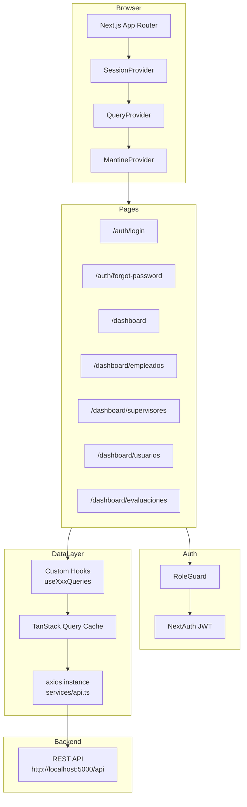

---

## 4. Flujo de autenticación

La autenticación usa **NextAuth v5** con el provider `Credentials`. El backend entrega `accessToken` y `refreshToken` en el login; ambos se almacenan en el JWT de sesión del lado del servidor.

El cliente Axios (`services/api.ts`) incluye un interceptor de respuesta que detecta `401` y renueva el `accessToken` automáticamente usando el `refreshToken` guardado en `localStorage`.

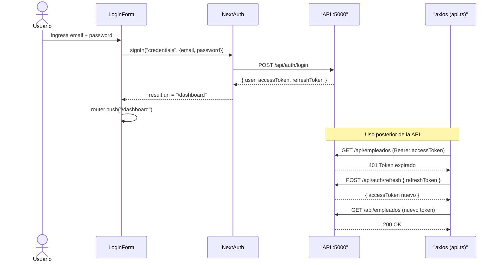

### Recuperación de contraseña

El flujo de recuperación es un proceso de 3 pasos implementado en `ForgotPasswordForm.tsx` mediante el hook `usePasswordRecovery.ts`:

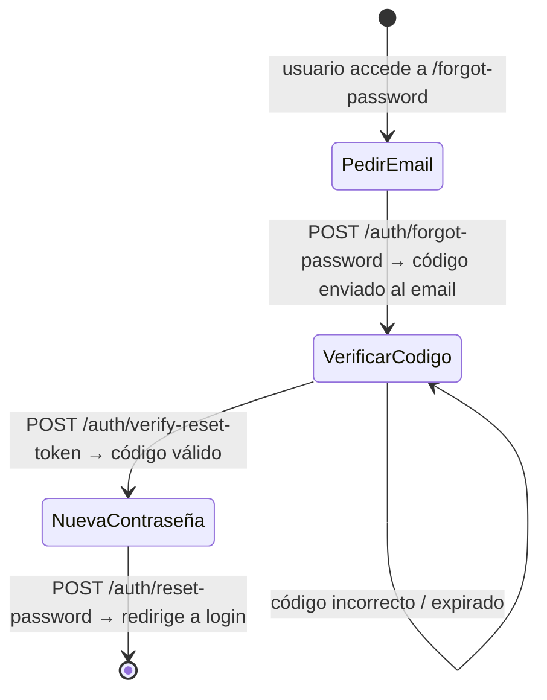

---

## 5. Enrutamiento y páginas

Todas las rutas bajo `/dashboard` están envueltas en `RoleGuard` a través del `layout.tsx` del segmento, que verifica la sesión activa y el rol del usuario antes de renderizar.

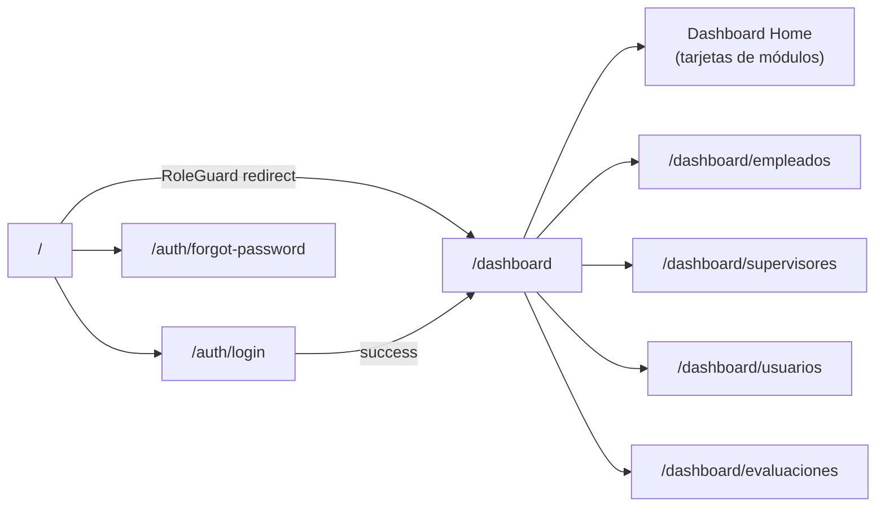

### Roles y acceso por módulo

| Ruta | Roles permitidos |
|---|---|
| `/dashboard` | ADMINISTRATIVO, DIRECTOR, COORDINADOR, SUPERVISOR |
| `/dashboard/usuarios` | ADMINISTRATIVO, DIRECTOR |
| `/dashboard/empleados` | ADMINISTRATIVO, DIRECTOR |
| `/dashboard/supervisores` | ADMINISTRATIVO, DIRECTOR |
| `/dashboard/evaluaciones` | SUPERVISOR, DIRECTOR, COORDINADOR |

---

## 6. Control de acceso por rol

`RoleGuard` es un componente cliente que inspecciona la sesión de NextAuth y redirige si el rol del usuario no está en la lista `roles` permitida.

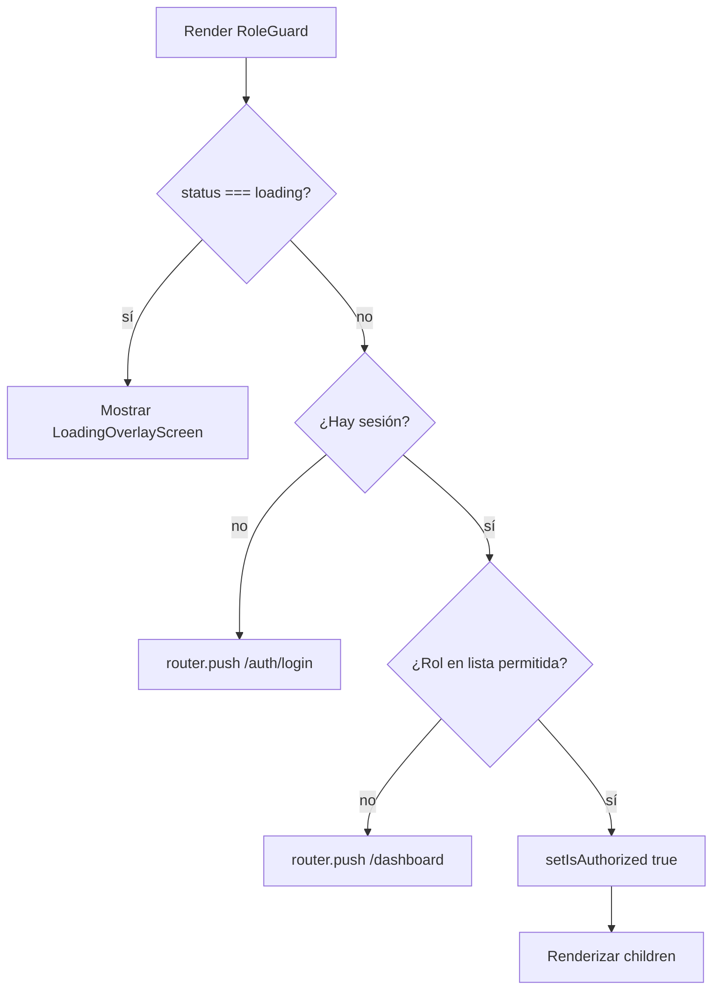

---

## 7. Capa de datos — Hooks y API

### Instancia Axios (`services/api.ts`)

- Base URL configurable hacia `http://localhost:5000/api`.
- Función `setAuthToken` para inyectar el `Authorization: Bearer` header.
- Interceptor de respuesta para refresh token automático en caso de `401`.

### Patrón de hooks por entidad

Cada entidad de dominio tiene su propio módulo de hooks bajo `hooks/<entidad>/`. Todos siguen el mismo patrón:

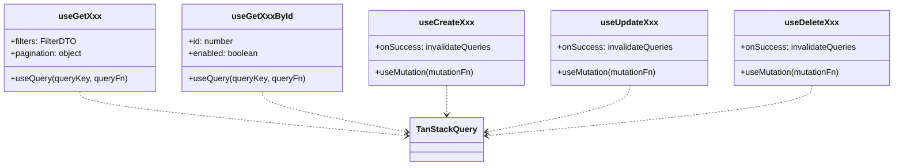

### Hooks disponibles por entidad

| Entidad | Query Key | Operaciones extra |
|---|---|---|
| Empleado | `"empleados"` | generateSolicitudPermiso, generateNotificacion, sendSolicitudPermisoEmail, sendNotificacion, generateEmpleadosReport |
| Usuario | `"usuarios"` | — |
| Supervisor | `"supervisores"` | — |
| Evaluación | `"evaluaciones"` | generatePdf, calcularTotales, sendEvaluacionEmail |
| ItemEvaluacion | `"itemsEvaluacion"` | — |
| EvaluacionItemResultado | `"evaluacionItemResultados"` | createOrUpdate, validateODIs |
| Auth | — | forgotPassword, verifyResetToken, resetPassword |

---

## 8. Componentes

### Componente genérico `CRUDTable<T>`

Es la pieza reutilizable central para todos los listados. Recibe columnas, datos y callbacks para operaciones CRUD.

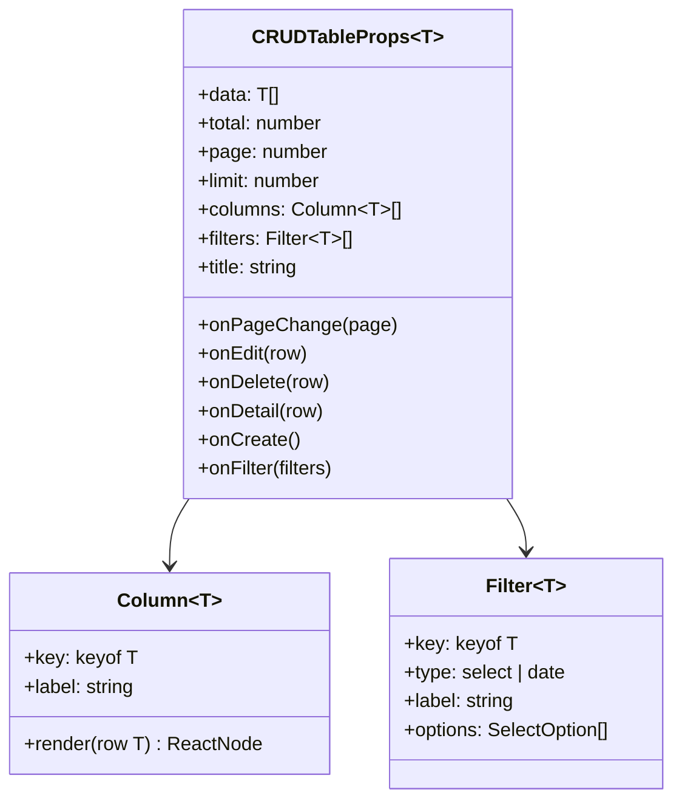

### Jerarquía de componentes por módulo

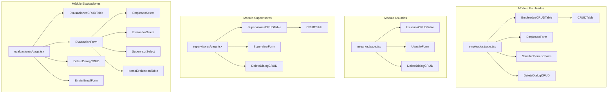

### Patrón de modal único por página

Cada página de módulo usa un estado `modal: ModalType` para controlar un único `<Modal>` de Mantine con contenido dinámico. Los tipos posibles son: `none`, `create`, `edit`, `view`, `delete`, `mail-*`.

---

## 9. Schemas de validación (Zod)

Los schemas sirven simultáneamente como contrato de tipos TypeScript y como validadores en tiempo de ejecución para formularios y DTOs de red.

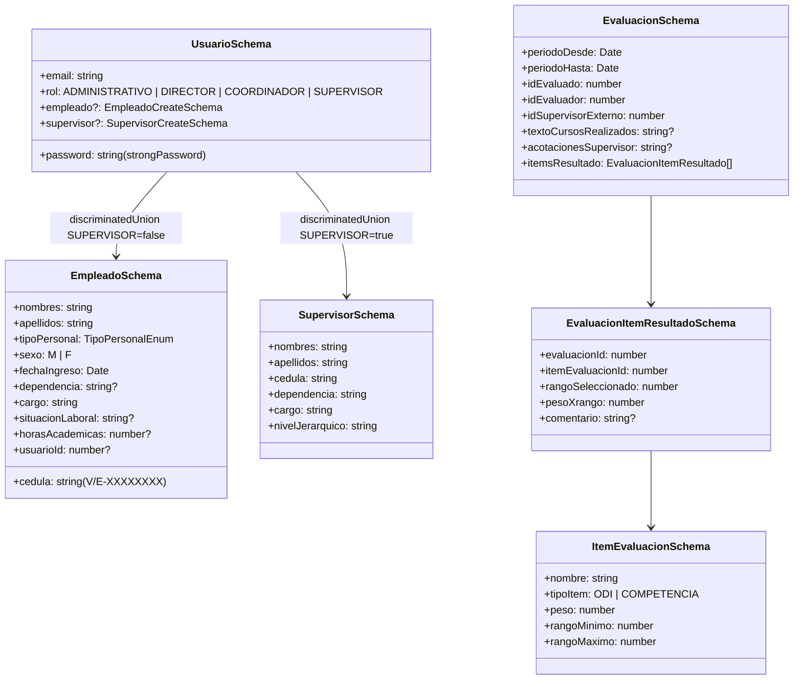

### Roles del sistema

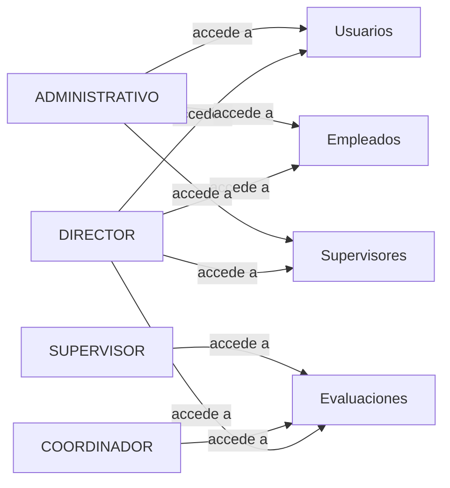

---

## 10. Helpers

| Archivo | Función principal |
|---|---|
| `evaluacion.ts` | `calcularRangoActuacion(total)` — convierte puntuación a rango textual; `calcularTotales(items)` — suma módulo I (ODI) y módulo II (COMPETENCIAS) |
| `selectsData.ts` | Datos estáticos para todos los `<Select>`: roles, tipos de personal, dependencias, cargos, materias, especialidades |
| `dateHelpers.ts` | `parseDDMMYYYY` — convierte cadenas `DD-MM-YYYY` a objetos `Date` |
| `date-parse.ts` | Utilidades auxiliares de parseo de fechas |
| `badges.ts` | Mapeo de valores de enum a colores de badge para Mantine |

### Lógica de evaluación — Rangos de actuación

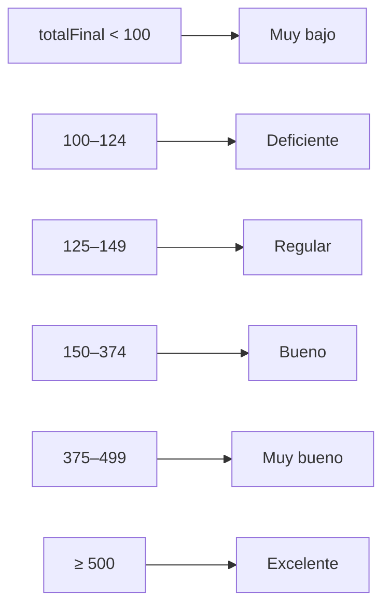

---

## 11. Diagrama de componentes por módulo

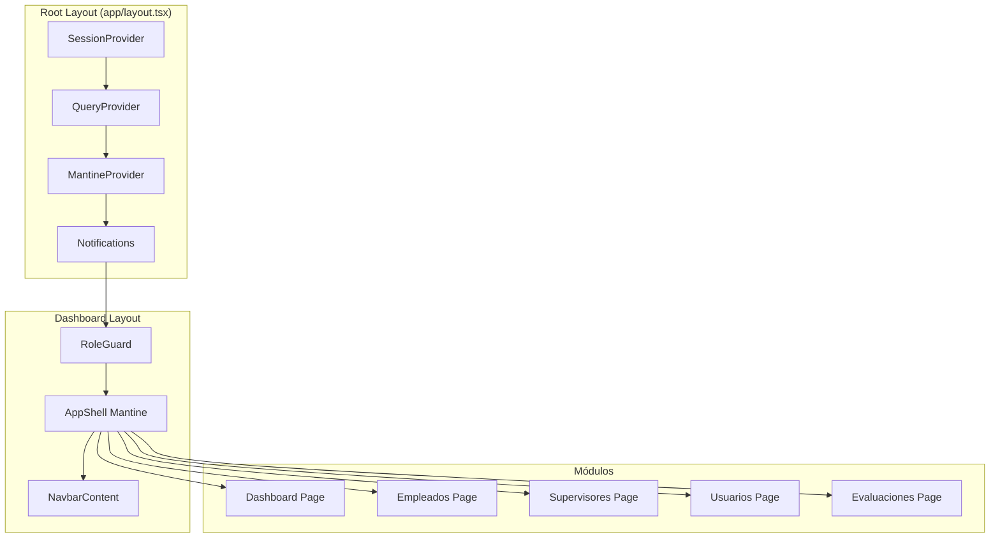

---

## 12. Diagrama de secuencia — Login

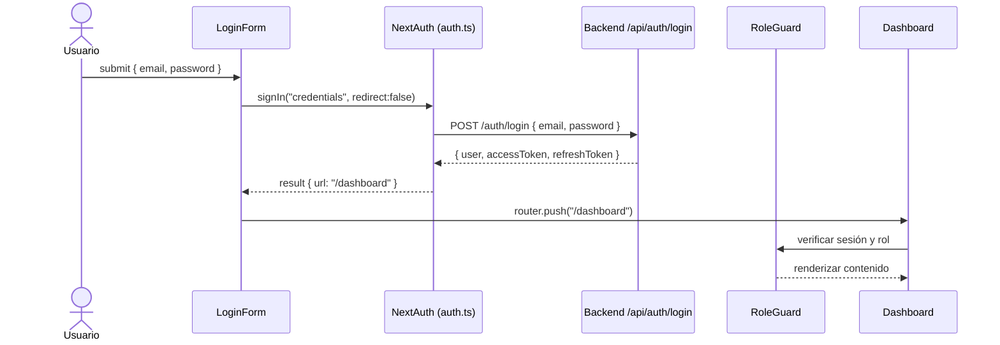

---

## 13. Diagrama de secuencia — CRUD genérico

El siguiente diagrama representa el flujo estándar de cualquier operación de creación en los módulos (Empleados, Usuarios, Supervisores, Evaluaciones):

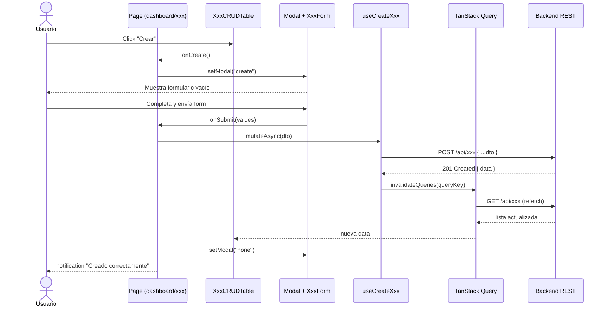

---

## 14. Diagrama de clases — DTOs / Schemas

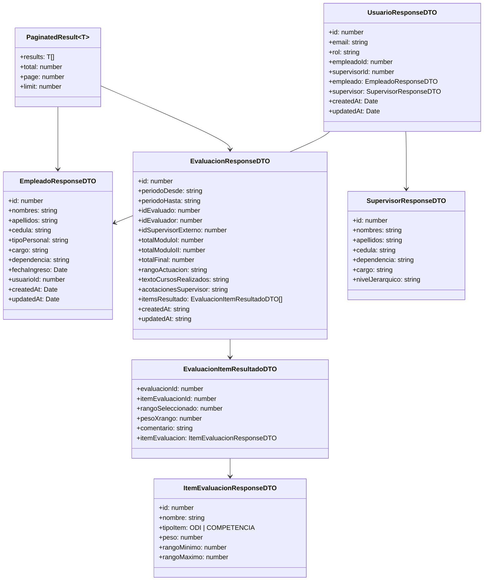

---

## 15. Diagrama de estados — modal CRUD

Todos los módulos de dashboard comparten el mismo patrón de estado de modal:

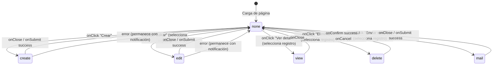

---

> **Generado automáticamente** a partir del análisis del código fuente en `web/`.  
> Última actualización: junio 2026.
